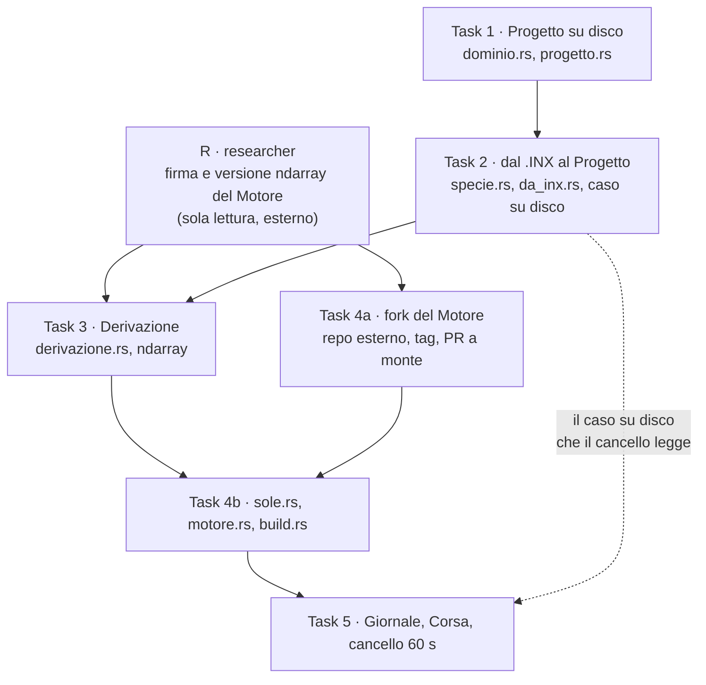

# Nucleo di calcolo — annotazione di dispatch

Compagno di [`2026-08-31-nucleo-di-calcolo.md`](2026-08-31-nucleo-di-calcolo.md). Il piano dice **cosa** si costruisce; questo documento dice **chi** lo costruisce, **in che ordine**, **con quali skill obbligatorie**, **chi rivede** e **cosa si guarda per accorgersi in tempo che sta andando storto**. Non modifica nessuno step del piano.

Provenienza: scritto da `/mnt/c/Users/mario/GitHub/CLIMESH`, branch `main`, HEAD `f377c44`, con il piano, `docs/spec.md`, `CLAUDE.md`, `CONTEXT.md`, `docs/adr/0001-oggetti-e-raster.md`, `.github/workflows/ci.yml`, `src/lib.rs`, `src/inx.rs`, `src/bin/extract_inx.rs`, `Cargo.toml` e `casi/bastia/valori-di-riferimento.toml` letti per intero in sessione. Esecuzione prevista con `superpowers:subagent-driven-development`: un implementatore fresco per task, revisione dopo ogni task, revisione ampia alla fine.

---

## 1. Il blocco che ogni dispatch porta addosso

Un subagente non eredita niente: né `CLAUDE.md`, né la spec, né questa pagina. Le sei righe qui sotto vanno **copiate in ogni prompt di dispatch**, qualunque sia il task, perché sono le trappole che non appartengono a nessun task in particolare e feriscono tutti.

1. **Le righe corrono da nord.** Riga `0` di ogni raster è la più settentrionale. `inx::Matrix::at(i, j)` fa già la conversione dagli indici ENVI-met (`src/inx.rs:101`), e `Matrix::cells` è già in ordine di scrittura, prima riga a nord (`src/inx.rs:89-95`). Non reimplementare la conversione, non ruotarla "per far tornare un test". Un verso sbagliato produce un modello specchiato che resta plausibile a occhio.
2. **Il vocabolario è vincolante nei nomi dei tipi.** `Progetto`, `Griglia`, `Scenario`, `Periodo`, `Corsa`, `Giornale`, `Edificio`, `Albero`, `Superficie`, `PuntoDiOsservazione`, `Provenienza`, `Derivazione`, `Motore` restano in italiano; tutto il resto della lingua del codice — identificatori, commenti, messaggi di commit — è inglese. I sinonimi vietati stanno in `CONTEXT.md` sotto `_Avoid_`.
3. **Il comando di test non è `cargo test`.** Su questa macchina Rust non è nel PATH e manca un linker C. Ogni esecuzione va scritta per esteso:
   ```bash
   export PATH=$HOME/.cargo/bin:$PATH
   CARGO_TARGET_X86_64_UNKNOWN_LINUX_MUSL_LINKER=rust-lld \
     cargo test --target x86_64-unknown-linux-musl --test <nome>
   ```
   Un `cargo test` liscio non fallisce nel test: fallisce nel collegamento, e il messaggio manda a caccia della cosa sbagliata.
4. **`materiale università/` non è nel repository e non ci entra.** È in `.gitignore`, non è ridistribuibile, e non se ne copia il contenuto in nessuna forma — né come file, né come citazione lunga, né come test fixture. I test che lo leggono si saltano da soli (`let Some(x) = leggi_il_caso() else { return }`). Conseguenza da tenere presente: in CI quei test passano **senza verificare niente**, e il verde non è una prova.
5. **Nessuna dipendenza nativa.** Prima di aggiungere un crate, verificarlo su crates.io e con `cargo tree -e normal | grep -iE "sys$|cc |bindgen"`. Niente GDAL, PROJ, NetCDF. Il prodotto è un binario singolo che si scarica e si apre.
6. **Test prima dell'implementazione, sempre.** Ogni task del piano comincia da un test che fallisce, e va verificato che fallisca *per il motivo giusto* (import non risolto, non un errore di setup) prima di scrivere la riga di produzione.

Aggiunta procedurale: **il piano non è vangelo**. Questo documento elenca alla sezione 8 i difetti trovati prima dell'esecuzione. Se un implementatore ne incontra un altro, si ferma e lo riporta invece di aggirarlo; le rulings restano al controllore, non all'implementatore.

---

## 2. Il grafo delle dipendenze vere

Il piano dichiara che ogni strato è verificabile senza il successivo. È vero per la *verifica*, non per la *costruzione*: le interfacce creano un ordine che non si può negoziare.



**Cosa può girare in parallelo, e a quali condizioni.**

- `researcher` e Task 1 sì, senza attriti: il researcher è in sola lettura e non tocca un file del repository. Va lanciato **per primo**, in contemporanea al dispatch di Task 1.
- Task 4a e Task 1/2/3 sì: Task 4a lavora in un clone di `UMEP-dev/solweig` fuori da questo repository e non scrive un solo file di CLIMESH. Unico punto di contatto è il tag prodotto, che serve solo a Task 4b.
- **Tutto il resto è sequenziale, e non per prudenza.** Tutti e cinque i task modificano `src/lib.rs`; quattro modificano `Cargo.toml` e `Cargo.lock`. Due implementatori in parallelo si pestano i piedi sul manifesto delle dipendenze e sull'elenco dei moduli, che sono le due righe più contese del progetto. Vale comunque la regola di `subagent-driven-development`: mai due implementatori insieme.
- Dipendenza **non dichiarata dal piano**: Task 3 pinna `ndarray = "0.16"`, ma il tipo che Task 4b passa al Motore è `dsm.view()`, cioè una `ArrayView2` della *nostra* versione di ndarray. Se il Motore è compilato contro una minor diversa, i due tipi non sono lo stesso tipo e il collegamento non compila. La versione di ndarray del Motore va quindi conosciuta **prima di Task 3**, non a Task 4. È il primo motivo per cui il researcher parte per primo.
- Dipendenza **implicita** che il piano nomina di sfuggita: il cancello di Task 5 legge `casi/bastia/progetto`, che nasce nello step 6 di Task 2. Se quello step viene tagliato o sbagliato, il fallimento si manifesta quattro task dopo.

---

## 3. Assegnazioni in breve

| # | Task | Subagente | Skill-gate | Ordine | Revisori |
|---|---|---|---|---|---|
| R | Firma del Motore, versione ndarray, licenza | `researcher` | true | in parallelo, per primo | nessuno (sola lettura, l'output è un dossier) |
| 1 | Il Progetto su disco | `backend-engineer` | true | sequenziale, primo | `code-reviewer`, `test-writer`, `security-reviewer` (ristretto) |
| 2 | Dal `.INX` al Progetto | `backend-engineer` | true | sequenziale, dopo 1 | `code-reviewer`, `test-writer`, `craft-reviewer` |
| 3 | La Derivazione | `backend-engineer` | true | sequenziale, dopo 2 | `code-reviewer`, `test-writer` |
| 4a | Il fork del Motore | `coder` | **false** (meccanico, e `coder` non ha il tool `Skill`) | in parallelo, dopo R | `security-reviewer` (catena di fornitura) |
| 4b | Posizione solare e collegamento | `backend-engineer` | true | sequenziale, dopo 3 e 4a | `code-reviewer`, `test-writer` |
| 5 | Giornale, Corsa, cancello | `backend-engineer` | true | sequenziale, ultimo | `code-reviewer`, `test-writer`, `craft-reviewer` |

I revisori sono in sola lettura e indipendenti fra loro: si dispacciano **in parallelo**, non in sequenza. La revisione ampia di fine ramo (`superpowers:requesting-code-review`, modello più capace) resta oltre a queste.

**Nota sulle skill, valida per tutti i task di codice.** Il roster wired di `backend-engineer` è `senior-backend`, che è tarata su API REST, query SQL, auth e migration: **nessuno dei suoi trigger tocca un crate Rust di calcolo numerico**. Il gate quindi si soddisfa altrove — `superpowers:test-driven-development` come skill portante (gli step 2·3·6 di ogni task sono letteralmente rosso-verde), `ponytail:ponytail` prima di scrivere, `caveman:caveman` sul report — e il salto di `senior-backend` va **dichiarato nel report con il motivo**, come vuole la regola. Un salto silenzioso resta un errore. Vedi anche la sezione 9: qui c'è un buco di roster.

**Conflitto fra due skill, regola unica.** Il piano ha la precedenza sul giudizio di una skill; la spec ha la precedenza sul piano. In concreto: se `ponytail` chiede di cancellare qualcosa che il piano prescrive testualmente — per esempio `Data::giorno_dell_anno`, che a Task 1 non è ancora usata da nessuno — la riga resta, e la tensione va **scritta nel report**, non risolta a mano dall'implementatore. Al contrario, `ponytail` ha via libera su tutto ciò che il piano *non* chiede: nessuna astrazione in più, nessun trait con una sola implementazione, nessun modulo di comodo. E dove `test-driven-development` e `ponytail` sembrano confliggere ("meno codice" contro "un test in più"), vince il test: `ponytail` stesso dice che la logica non banale lascia dietro un controllo eseguibile.

---

## 4. Il dossier del researcher, prima di tutto

**Subagente:** `researcher`. **Skill-gate:** true. **Parallelo:** sì, contemporaneo a Task 1.

Perché `researcher` e non l'implementatore: la domanda è di sola lettura, sta su un repository esterno, e la risposta cambia due decisioni prese in due task diversi. Farla scoprire a Task 4b significa scoprirla dopo che Task 3 ha già pinnato la versione sbagliata di ndarray.

Mandato, quattro domande secche su `UMEP-dev/solweig` alla revisione che si intende pinnare:

1. La firma esatta di `calculate_shadows_rust` in `rust/src/shadowing.rs`: ordine e tipo dei parametri, tipo di ritorno, e se il ritorno è una struttura invece di un singolo raster.
2. La versione di `ndarray` nel `Cargo.toml` del crate, e se l'API pubblica espone tipi di ndarray (`ArrayView2`, `Array2`) nella firma.
3. Se `crate-type` è davvero solo `cdylib` e quali altri simboli del percorso ombre sono `pub(crate)`, cioè quante funzioni il fork deve aprire, non solo una.
4. La licenza effettiva del crate e la sua compatibilità con `GPL-3.0-or-later` dichiarata in `Cargo.toml`.

Deve citare `file:riga` o URL per ognuna, e marcare esplicitamente ciò che non ha potuto verificare. Non decide e non implementa.

---

## 5. Task per task

### Task 1 — Il Progetto su disco

**Subagente:** `backend-engineer`. È data layer puro: tipi, serializzazione, validazione, errori. Nessuna superficie utente.
**Esclusioni motivate:** `coder` era contendibile — "sono tipi e due funzioni di I/O" — ed è escluso per due ragioni: il task contiene validazione con logica (coerenza griglia/terreno) e definisce la tassonomia di errori che tutti i task successivi consumano; e `coder` non ha il tool `Skill`, quindi su di lui il gate TDD non è imponibile. `test-writer` è escluso perché qui i test nascono prima del codice: sono dell'implementatore, non di un rinforzo a posteriori.

**Skill obbligatorie.** `superpowers:test-driven-development` sugli step 2·3·6 (il test rosso esiste già scritto nel piano: il lavoro è farlo fallire per il motivo giusto e poi verde). `ponytail:ponytail` prima di scrivere `progetto.rs`, con un compito preciso: il piano ha già scelto il gradino basso — nessuna dipendenza per i file temporanei, nessuna crate di date per tre campi — e il compito di ponytail è impedire che l'implementatore risalga la scala. `caveman:caveman` sul report. `senior-backend` non pertinente, salto da dichiarare.

**Sequenza:** primo, da solo. Tutto dipende da qui.

**Chi rivede, e su cosa.**
- `code-reviewer`: sì, integrale. È il task che fissa le forme dei dati per tutto il resto; un campo sbagliato qui si paga cinque volte.
- `test-writer`: sì, sul contratto degli ingressi degeneri qui sotto, riga per riga.
- `security-reviewer`: sì, ma **ristretto a una domanda sola** — `scrivi` costruisce percorsi da `s.nome` e `x.nome` (`dir.join(format!("{}.toml", s.nome))`). Un nome di Scenario che contiene `..` o `/` scrive fuori dalla cartella del Progetto. Il Progetto è un formato che gli utenti si scambiano, quindi quel nome è input esterno. Nessun altro capitolo di audit: non c'è auth, non ci sono segreti, non c'è rete.
- `craft-reviewer`: **no, sarebbe teatro.** Non c'è niente che un umano legga oltre ai commenti di modulo, e quelli li copre `code-reviewer`.

**Rischio principale e segnale osservabile.** Il rischio è che la serializzazione TOML non regga la forma delle struct: TOML vuole i valori scalari *prima* delle tabelle, e `Periodo` mette `inizio` (tabella) prima di `ore` e `direzione_vento_gradi`, mentre `Manifesto` mette `griglia` prima di `scenari` e `periodi`. Indizio che non ho inventato: il TOML scritto a mano nello step 6 di Task 2 mette `[inizio]` **in fondo**, cioè contraddice l'ordine dei campi della struct. Segnale osservabile, e arriva subito: al primo giro verde-atteso, l'errore non è un `assert_eq` fallito ma un errore di serializzazione da `toml::to_string_pretty`. Se compare, la correzione è riordinare i campi (tabelle in coda), non incapsulare. Non ho potuto compilare per confermarlo — niente rete per scaricare i crate — quindi resta una previsione da verificare allo step 3, non un fatto.

## Ingressi degeneri
- griglia con `nx` o `ny` a zero → `scrivi` rifiuta nominando "griglia" e non lascia file a metà su disco
- terreno di lunghezza diversa da `nx * ny` → rifiuta con entrambi i numeri nel messaggio, attese e trovate
- cartella senza `progetto.toml` → errore che nomina `progetto.toml`, non un "file non trovato" generico
- scenario elencato nel manifesto ma assente su disco → errore che nomina lo scenario mancante
- nome di Scenario o Periodo contenente `/`, `\` o `..` → rifiutato prima di aprire il file, nessuna scrittura fuori dalla cartella del Progetto
- `Data` con mese `0` o `13` → `giorno_dell_anno` ritorna un valore definito o un errore, non va in panico per indice fuori dai limiti
- TOML sintatticamente rotto → errore che nomina il file, non un panic del deserializzatore

---

### Task 2 — Dal `.INX` al Progetto

**Subagente:** `backend-engineer`. È un lettore di ingresso che produce oggetti di dominio: data layer, secondo la spec §3.
**Esclusioni motivate:** `coder` è di nuovo contendibile, perché metà del task è una tabella di costanti e la scrittura di due file di dati a mano. Escluso perché l'altra metà è la conversione di indici da ENVI-met a celle nostre, cioè esattamente il punto dove un errore silenzioso sopravvive a ogni ispezione visiva (`CLAUDE.md`, "Trappola da conoscere"). `debugger` non c'entra: non c'è un bug riportato.

**Skill obbligatorie.** `superpowers:test-driven-development`; `ponytail:ponytail` prima di `da_inx.rs`, in particolare per non introdurre un livello di astrazione fra `inx::Inx` e `Progetto` che il piano non chiede; `caveman:caveman` sul report. `senior-backend` non pertinente, salto da dichiarare.

**Sequenza:** dopo Task 1, in serie. Consuma `dominio::*` e `progetto::scrivi`, e lo step 6 scrive il caso di riferimento che servirà a Task 5.

**Chi rivede, e su cosa.**
- `code-reviewer`: sì, con un'attenzione nominata — l'aritmetica `g.grids_j - p.j` su `usize`. Sottrazione che va sotto zero se `j > grids_j`; oggi è protetta perché `src/inx.rs:452-461` valida gli indici delle piante in lettura, e questa protezione va citata nel commento, non lasciata implicita.
- `test-writer`: sì, contratto qui sotto.
- `craft-reviewer`: sì, e non è teatro. Questo task produce due cose che un umano legge: i file TOML del caso di riferimento in `casi/bastia/progetto/`, che restano nel repository e si citano; e le stringhe di `Provenienza` (`"LAB1.INX, matrice zTop"`), che sono la risposta alla domanda "quell'altezza da dove viene" — cioè la ragione per cui l'ADR 0001 esiste.
- `security-reviewer`: **no.** L'unico input esterno è il `.INX`, letto da `src/inx.rs`, che questo task non tocca e che valida già i propri indici. Un audit qui riesaminerebbe codice non modificato.

**Rischio principale e segnale osservabile.** Il rischio è il modello specchiato: un verso sbagliato nella conversione `(grids_j - j, i - 1)` sposta tutto di 180° e nessun test del piano se ne accorge, perché il test calcola l'atteso con la stessa espressione dell'implementazione (difetto D5 in sezione 8). Il segnale osservabile esiste già nel repository e va usato come oracolo indipendente: `casi/bastia/valori-di-riferimento.toml`, `[verifica_scenario]`, registra che **nessuna delle 616 istanze di vegetazione è radicata su una cella con `zTop > 0`**. Se dopo la conversione anche un solo Albero cade su una cella costruita, il verso è sbagliato. È un assert di tre righe e vale più dell'intero test attuale.

## Ingressi degeneri
- `.INX` senza matrice `zTop` → nessun Edificio, non un Edificio di altezza zero
- `.INX` senza `terrainheight` → terreno di `nx * ny` zeri, e la Provenienza lo dichiara stimato
- matrice presente con numero di celle diverso da `grids_i * grids_j` → errore che nomina la matrice, non un terreno di lunghezza sbagliata che Task 1 rifiuterà a valle
- `plantID` sconosciuto → altezza predefinita dichiarata e `FonteAltezza::Predefinito`, mai altezza zero
- pianta con `j` fuori da `1..=grids_j` → l'errore arriva da `inx.rs`, `da_inx` non sottrae prima di sapere
- zero istanze di vegetazione nel file → Progetto valido con zero Alberi, non un fallimento
- `location.name` che è un refuso noto (`"bergamo"` per un caso a Bastia) → il nome del Progetto non lo eredita in silenzio

---

### Task 3 — La Derivazione

**Subagente:** `backend-engineer`. È il nucleo di modellazione: oggetti in raster, con le scelte che finiscono nel Giornale.
**Esclusioni motivate:** nessun'altra scelta è seria. Non è UI, non è glue, non è un rinforzo di copertura.

**Skill obbligatorie.** `superpowers:test-driven-development`, `ponytail:ponytail` (il piano ha già una funzione sola, `deriva`, e la tentazione sarà spezzarla in cinque: non farlo finché non cresce), `caveman:caveman` sul report. `senior-backend` non pertinente.

**Sequenza:** dopo Task 2, in serie: consuma `specie::e_decidua`. Non può iniziare prima che il researcher abbia risposto sulla versione di `ndarray`, perché lo step 1 la pinna.

**Chi rivede, e su cosa.**
- `code-reviewer`: sì, integrale.
- `test-writer`: sì, e qui è il caso più utile di tutto il piano: il contratto degli ingressi degeneri di `deriva` è più lungo del codice di `deriva`.
- `security-reviewer`: **no, sarebbe teatro dichiarato.** `deriva` è una funzione pura da strutture in memoria a strutture in memoria: nessun file, nessuna rete, nessun input non già validato a monte, nessun dato utente.
- `craft-reviewer`: **no.** Niente che un umano legga.

**Rischio principale e segnale osservabile.** Il rischio è una scelta di modellazione presa in silenzio: `Array2::from_shape_vec(...).unwrap_or_else(|_| Array2::zeros(forma))` sostituisce un terreno di forma sbagliata con un terreno piatto e non lo registra da nessuna parte, che è precisamente ciò che l'ADR 0001 e la spec §7 vietano. Segnale osservabile: `scelte.celle_costruite` e `scelte.celle_con_chioma` a zero su uno Scenario che ha oggetti, oppure un raster `terreno` tutto a zero mentre il TOML dello Scenario dice altro. Entrambi si leggono dal Giornale, ma solo se qualcuno li ci mette: la correzione è un contatore in `ScelteDiDerivazione`, non un `unwrap_or_else` più silenzioso.

## Ingressi degeneri
- terreno di lunghezza diversa da `nx * ny` → conteggiato nelle scelte e visibile nel Giornale, mai sostituito in silenzio da zeri
- oggetto su cella fuori griglia → contato in `oggetti_fuori_griglia`, nessun panico, nessuna cella scritta
- due Alberi sulla stessa cella → resta la chioma più alta, e la zona-tronco è quella dell'albero che ha vinto, non un residuo del precedente
- Scenario senza alcun oggetto → i cinque raster hanno la forma della griglia e le scelte sono tutte a zero
- Albero con altezza zero o negativa → non produce una chioma sotto il piano del terreno
- frazione di tronco fuori da `0.0..1.0` → serrata o rifiutata, e in entrambi i casi registrata nelle scelte
- Periodo senza foglie con solo sempreverdi → `chiome_escluse` a zero, che non è la stessa cosa di un raster di chiome vuoto

---

### Task 4a — Il fork del Motore

**Subagente:** `coder`. È lavoro di configurazione e di comandi su un repository esterno: `gh repo fork`, due righe di `Cargo.toml`, una visibilità da `pub(crate)` a `pub`, un tag, una PR a monte.
**Esclusioni motivate:** `backend-engineer` è escluso perché non si scrive logica e non c'è niente da testare con TDD; dargli il task significa sprecare il suo gate su un'operazione meccanica. `researcher` è escluso perché qui si scrive: il researcher è sola lettura e ha già fatto la sua parte.

**Skill-gate: false.** Motivo dichiarato: il task è meccanico — due edit di configurazione e una sequenza di comandi `gh` già scritti nel piano — e `coder` non possiede il tool `Skill`, quindi il gate non sarebbe imponibile comunque. È il solo `false` del piano.

**Sequenza:** in parallelo a Task 1·2·3, subito dopo il dossier del researcher. Non tocca un solo file di CLIMESH, quindi non collide con niente. Va lanciato presto: una PR a monte ha latenza che non dipende da noi, e il tag serve a Task 4b.

**Chi rivede, e su cosa.**
- `security-reviewer`: sì, ed è **l'unico punto del piano dove un audit di sicurezza non è teatro**. Entra una dipendenza git che punta a un fork personale, pinnata a un tag che chi controlla il fork può spostare; e va confermata la compatibilità di licenza fra GPL-3 del Motore e `GPL-3.0-or-later` dichiarata nel nostro `Cargo.toml`. Mandato ristretto: catena di fornitura e licenza, non il codice del Motore, che non è nostro.
- `code-reviewer`: sì ma leggero, sul solo diff del fork (due righe).
- `test-writer`, `craft-reviewer`: no.

**Rischio principale e segnale osservabile.** Il rischio è che aprire una funzione non basti: se il percorso ombre chiama altri simboli `pub(crate)`, il fork compila come `cdylib` e fallisce come `rlib`. Segnale osservabile, e va cercato subito invece di aspettare Task 4b: `cargo build --release -p rustalgos` non è la prova. La prova è un crate scratch di tre righe che dipende dal fork e chiama la funzione — se compila, l'API è davvero nativa; se no, si scopre ora e non fra due task.

## Ingressi degeneri
- nessun ingresso esterno: il task esegue comandi su un repository esterno e non riceve dati da altri step. Gli ingressi degeneri veri del collegamento stanno in Task 4b, dove si scrive il chiamante.

---

### Task 4b — Posizione solare e collegamento

**Subagente:** `backend-engineer`. Calcolo numerico e il modulo che isola la dipendenza esterna.
**Esclusioni motivate:** `coder` no, c'è astronomia da testare; `debugger` no, non c'è un bug.

**Skill obbligatorie.** `superpowers:test-driven-development` — qui è vincolante in modo particolare, perché il piano dice esplicitamente che se il test dell'ombra fallisce **non si ruota il test**, si corregge la conversione. `ponytail:ponytail` prima di `motore.rs`: nessun trait `Motore`, nessuna astrazione per un'implementazione sola, il piano ha già scelto il modulo unico come confine. `caveman:caveman` sul report.

**Sequenza:** dopo Task 3 (consuma `derivazione::Raster`) e dopo Task 4a (serve il tag). Punto di giunzione dei due rami del grafo.

**Chi rivede, e su cosa.**
- `code-reviewer`: sì, con attenzione nominata al `build.rs`: legge `Cargo.lock` con un parser a righe che assume un ordine di campi (`name`, poi `version`, poi `source`) e non azzera mai il proprio flag `dentro`.
- `test-writer`: sì, contratto qui sotto.
- `security-reviewer`: no, già coperto in 4a; ripeterlo sul chiamante sarebbe teatro.
- `craft-reviewer`: no.

**Rischio principale e segnale osservabile.** Due rischi distinti. Il primo è la convenzione di azimut: il nostro azimut corre in senso orario da nord, quello del nucleo potrebbe correre da sud o in senso antiorario. Segnale osservabile e diagnostico, non generico: nel test della torre, l'ombra che cade **a sud** invece che a nord significa origine a sud (differenza di 180°); l'ombra a est o a ovest significa verso invertito (segno). Il test già distingue i tre casi, purché si legga *quale* asserzione è fallita invece del solo "test rosso".

Il secondo rischio è il budget, e questo task è il posto dove si vede per primo, non Task 5. **Misura obbligatoria da riportare nel report di Task 4b:** il tempo di una singola chiamata `motore::ombre` su un raster 50×50. Il cancello richiede almeno 96 chiamate (2 Periodi × 48 ore, per Scenario). Se una chiamata costa più di ~300 ms, il cancello è già perso e lo si sa un task prima di arrivarci.

## Ingressi degeneri
- sole sotto l'orizzonte (`altezza_gradi <= 0`) → tutto in ombra e nessuna chiamata al nucleo, perché è una scelta di modellazione nostra e non una proprietà geometrica
- dominio piatto con sole alto → nessuna cella in ombra
- raster 1×1 → ritorna senza panico e senza indicizzare fuori
- firma di `calculate_shadows_rust` diversa da quella attesa → si adatta **solo** `motore::ombre`, e la firma trovata si annota nel commento di modulo
- versione di `ndarray` del Motore diversa dalla nostra → il collegamento non compila: si allinea la nostra alla sua, non si converte cella per cella
- `Cargo.lock` senza voce `rustalgos`, o con `source` senza `#rev` → `versione()` restituisce i segnaposto dichiarati, la compilazione non fallisce e il Giornale dice "sconosciuta" invece di mentire
- giorno dell'anno 366 su anno non bisestile, ora 24.0 → posizione definita, nessun `NaN` propagato

---

### Task 5 — Il Giornale e il cancello dei 60 secondi

**Subagente:** `backend-engineer`. Orchestrazione, I/O e le verifiche numeriche per Corsa.
**Esclusioni motivate:** `coder` è contendibile sull'orchestrazione (`corsa.rs` è in buona parte due cicli annidati) ma escluso perché il Giornale è il prodotto citabile del programma: formato, invarianti e riproducibilità sono logica, non glue. `craft-reviewer` interviene come revisore, non come autore: il Giornale è un documento, ma la sua correttezza è di chi scrive il codice.

**Skill obbligatorie.** `superpowers:test-driven-development`; `ponytail:ponytail` prima di `corsa.rs`, con un vincolo esplicito: il piano dice "nessun checkpoint del calcolo, a sessanta secondi il rimedio è premere di nuovo", quindi la scala si ferma lì e non si costruisce un sistema di ripresa; `caveman:caveman` sul report. `senior-backend` non pertinente.

**Sequenza:** ultimo, in serie. Consuma tutto.

**Chi rivede, e su cosa.**
- `code-reviewer`: sì, integrale.
- `test-writer`: sì, e con un mandato in più: i test del Giornale nel piano verificano con `contains` su una stringa. Un test che dice "il Giornale è un file TOML" deve **rileggere il file con `toml::from_str`**, altrimenti non verifica quel che dice.
- `craft-reviewer`: sì, ed è il suo terreno d'elezione. Il Giornale è ciò che un revisore umano legge per decidere se fidarsi di un risultato; la spec §7 dice che la vista nella pagina e l'appendice stampata sono rese di questo file. Nomi delle chiavi, ordine, leggibilità della riga di citazione: tutto suo.
- `security-reviewer`: **no.** Nessun input esterno nuovo, nessun dato utente, nessuna rete. Il solo dettaglio di superficie — la cartella della Corsa scritta dentro l'albero versionato — è igiene di repository, non sicurezza.

**Rischio principale e segnale osservabile.** Il rischio dichiarato è il cancello dei 60 secondi (sezione 6). Il rischio *non* dichiarato, e più insidioso, è che il Giornale non sia rileggibile: `annota("verifica", &format!("{inv:?}"))` inserisce le virgolette del `Debug` di `Inviluppo` (`campo: "ombra"`) dentro una stringa TOML, e i test con `contains` passano lo stesso. Segnale osservabile immediato, se lo si cerca: un `toml::from_str` del file scritto, in test. Senza quello, il difetto emerge quando la pagina proverà a leggere il Giornale, cioè in un altro piano.

## Ingressi degeneri
- campo tutto `NaN` → `frazione_senza_dato` a 1.0 e minimo/massimo dichiarati assenti, nessuna divisione per zero e nessun `fuori_intervallo` inventato
- campo vuoto (zero valori) → nessun panico e frazione definita, non `NaN` silenzioso
- dettaglio contenente virgolette, ritorni a capo o il carattere `·` → il Giornale resta un TOML che si rilegge, verificato rileggendolo
- Progetto senza Periodi, o senza Scenari → zero Corse e il Giornale lo dice, invece di un successo silenzioso con `corse = 0`
- Corsa interrotta a metà → il Giornale dice fin dove è arrivata e non lascia due esiti contraddittori nello stesso file
- cartella della Corsa non scrivibile → errore che nomina il percorso, sollevato prima di iniziare il calcolo e non dopo
- due Corse con gli stessi ingressi → stessa Impronta; un solo parametro diverso → Impronta diversa

---

## 6. Il cancello: cosa succede proceduralmente se sfora

Il piano dice "fermarsi". Fermarsi non è una procedura. Questa lo è.

**Passo 0 — il numero non basta.** Il cancello non si valuta su `durata > 60 s`. Il report di Task 5 deve portare la ripartizione: secondi spesi in `derivazione::deriva`, secondi in `motore::ombre`, secondi in scrittura di campi e Giornale, e il numero di chiamate al nucleo. Un cancello che sfora senza ripartizione fa riaprire la decisione sbagliata.

**Passo 1 — si dispaccia `debugger`, non un ottimizzatore.** Mandato: riprodurre la misura su `--release`, isolare dove va il tempo, e lasciare un test rosso mirato che asserisce la ripartizione attesa (per esempio: la derivazione non supera il 10% del totale). `debugger` non tocca codice di produzione, per contratto: consegna causa radice, test rosso e fix consigliato. È esattamente ciò che serve, perché la decisione su *quale* fix non è sua.

**Passo 2 — il bivio, e quale decisione della mappa si riapre.**

- **Se domina la derivazione ripetuta:** non è una decisione architetturale, è un difetto. La spec §5 dice "la cache è per Scenario, non per Corsa": sul caso di riferimento la derivazione va fatta due volte, non quattro. Si riapre nulla; si dispaccia `backend-engineer` con il test rosso del debugger e si rimette la cache dove la spec la vuole.
- **Se domina il nucleo:** si riapre la decisione sul **Motore** (spec §6), non l'architettura sopra. Le opzioni sul tavolo, che vanno confrontate e non scelte d'istinto: pinnare una revisione diversa del nucleo; tagliare la catena più in basso (ma la spec dice già perché sarebbe caro: si perdono i test di parità); promuovere il percorso GPU da accelerazione a requisito, che contraddice "l'utente di riferimento è su un portatile"; ridefinire il caso di riferimento, che contraddice i criteri di accettazione §9.
- **In entrambi i casi si riapre anche una seconda decisione**, e la spec lo dice a lettere: "Nessun checkpoint del calcolo: a 60 secondi il rimedio è premere di nuovo. **Se il budget saltasse, questa decisione va riaperta insieme a quello**" (§7). Un calcolo da tre minuti senza ripresa è un prodotto diverso.

**Passo 3 — chi produce cosa.** Si dispaccia `architect` per un **ADR 0002** in `docs/adr/` che metta le opzioni a confronto con i numeri del debugger, più un `researcher` se il confronto richiede fatti esterni (costo del percorso GPU, revisioni alternative del nucleo). L'ADR **non decide**: prepara la decisione.

**Passo 4 — decide Mario, e la mappa lo registra.** Il cancello è un criterio di accettazione della spec (§9), quindi lo scarto o la modifica è una decisione di prodotto, non di implementazione. Va nella mappa wayfinder (issue #1), come ticket, con l'ADR citato.

**Passo 5 — cosa resta fermo nel frattempo.** Tutto ciò che presuppone il budget: superfici, validazione, import da OpenStreetMap. Il piano lo dice e va rispettato. Ciò che può proseguire è solo la correzione dei difetti già trovati sui task 1–4, che non dipendono dal numero.

---

## 7. Task 4 e il fork esterno: come si gestisce il rischio della firma

Il piano ammette il rischio e lo confina bene — `motore.rs` è l'unico file che nomina il crate — ma lascia scoperto **quando** lo si scopre. La sequenza corretta è per scoperta anticipata, in tre mosse.

**Chi lo scopre per primo: il `researcher`, prima che Task 1 sia finito.** È in sola lettura, non collide con nessuno, e risponde alle quattro domande della sezione 4. Il costo è un dispatch; il beneficio è che nessuna delle tre sorprese possibili arriva a valle.

**Le tre sorprese, e la risposta a ciascuna.**

1. **Firma diversa** (ordine, tipi, o un `Result`/struttura invece di un raster): impatto contenuto, si adatta solo `motore::ombre`, come il piano prescrive. Nessuna decisione da riaprire. È il caso migliore ed è quello che il piano ha già previsto.
2. **Versione di `ndarray` diversa dalla nostra:** impatto **retroattivo su Task 3**, che pinna 0.16 tre task prima. Se si scopre a Task 4b, si torna indietro a cambiare il manifesto e a ricompilare tutto ciò che sta in mezzo. Per questo il researcher parte per primo: la versione del Motore diventa il vincolo, e Task 3 pinna quella.
3. **`pub(crate)` non è uno solo:** il fork deve aprire una catena di simboli, e il "cambia una riga" del piano diventa un diff da rivedere. Si scopre con il crate scratch della sezione Task 4a, non aspettando che Task 4b non compili.

**Il ripiego resta quello della spec (§6): il vendoring del sorgente**, e la spec dice esplicitamente che non dipende dall'esito della richiesta a monte. Se il fork non regge, si vendorizza a un commit pinnato e si registra la scelta nel Giornale come versione del Motore. Non è una decisione da riaprire: è già presa.

---

## 8. Difetti trovati nel piano

Segnalati, non aggirati. Ordinati per quanto costa scoprirli tardi. I primi quattro vanno risolti **prima** che parta Task 1.

**D1 — Il cancello chiede quattro Corse; il caso ne può produrre due.** Il test asserisce `esito.corse == 4`, "due Scenari per due Periodi". Ma `casi/bastia/valori-di-riferimento.toml`, chiave `per_avere_l_altro_scenario`, dice che il `.INX` degli interventi non esiste nel materiale e **non è ricostruibile** senza sapere dove vadano siepi e specchio d'acqua; e `progetto_da_inx` costruisce un solo Scenario. Il cancello, così com'è, non può passare. Le vie d'uscita sono due e vanno decise, non improvvisate: misurare due Corse e confrontarle con metà budget dichiarando la proiezione, oppure misurare quattro Corse duplicando lo Scenario **solo dentro il test**, senza scrivere un secondo Scenario falso nel Progetto. La seconda mantiene il numero della spec; la prima è più onesta sul dato. Decisione di Mario.

**D2 — Task 2 non compila per un derive mancante in Task 1.** `superfici_da` usa `BTreeMap<TipoSuperficie, Vec<Cella>>`, ma `TipoSuperficie` deriva `Debug, Clone, Copy, PartialEq, Eq, Serialize, Deserialize` e **non** `PartialOrd, Ord`, che `BTreeMap` pretende sulla chiave. Correzione: aggiungere i due derive in Task 1, dove la struct nasce.

**D3 — Ordine dei campi contro la regola TOML dei valori prima delle tabelle.** `Periodo` mette `inizio` (tabella) prima di `ore` e `direzione_vento_gradi`; `Manifesto` mette `griglia` prima di `scenari` e `periodi`. Il TOML scritto a mano nello step 6 di Task 2 mette `[inizio]` in fondo, cioè conferma il vincolo e contraddice la struct. Previsione, non fatto verificato: in questo ambiente non si può compilare per confermarlo. Va verificata al primo test di Task 1, e la correzione è riordinare i campi.

**D4 — Lo step 6 di Task 2 non è eseguibile come scritto, e si autodistrugge alla seconda esecuzione.** Il comando indicato è `cargo run --bin extract_inx` senza argomento, ma `src/bin/extract_inx.rs:11-14` esce con codice 2 se manca il percorso, e il binario scrive l'estratto su **stdout**, non su file (lo dice la sua stessa riga d'uso). Peggio: i Periodi e i Punti di osservazione si scrivono a mano in `progetto.toml`, che la volta successiva il generatore **sovrascrive**, cancellandoli — e con loro il cancello di Task 5, che ha bisogno dei Periodi. O il generatore li produce, o preserva ciò che trova, o i Periodi vivono in un file che non rigenera.

**D5 — Un test che non verifica quel che dice.** `a_tree_lands_on_the_cell_the_file_names` calcola l'atteso con `(letto.geometry.grids_j - primo.j, primo.i - 1)`, cioè con la stessa espressione dell'implementazione: se il verso è invertito, sbaglia due volte e passa in verde, sotto un messaggio che recita "le righe corrono da nord". Oracolo indipendente disponibile nel repository, sezione Task 2 sopra: nessuna delle 616 piante sta su una cella con `zTop > 0`.

**D6 — Il Giornale può non essere TOML valido.** `g.annota("verifica", &format!("{inv:?}"))` scrive il `Debug` di `Inviluppo`, che contiene `campo: "ombra"`: virgolette non protette dentro una stringa TOML. Nessun test se ne accorge, perché tutti verificano con `contains` invece di rileggere il file.

**D7 — Due esiti contraddittori nello stesso Giornale.** `apri` scrive `esito = "in corso"` al livello superiore; `concludi` e `fallisci` aggiungono `[conclusione]` con un altro `esito`. Un file appeso non può riscrivere la riga di sopra, quindi la chiave superiore non deve esistere.

**D8 — Una scelta di modellazione presa in silenzio.** `Array2::from_shape_vec(...).unwrap_or_else(|_| Array2::zeros(forma))` in `deriva` sostituisce un terreno di forma sbagliata con un terreno piatto senza registrare niente, mentre ADR 0001 e spec §7 vogliono le scelte della Derivazione nel Giornale.

**D9 — Dipendenza non dichiarata fra Task 3 e Task 4.** La versione di `ndarray` non è una scelta nostra: è quella del Motore, o i tipi non combaciano. Il piano la pinna a Task 3 e scopre il vincolo a Task 4.

**D10 — Lo snippet `[dependencies]` di Task 4 è distruttivo se applicato alla lettera:** mostra il solo `rustalgos` e cancellerebbe `serde`, `toml`, `ndarray`. È additivo. La sezione `[build-dependencies]` vuota che segue non serve a niente.

**D11 — Interfacce dichiarate che il codice non produce.** Task 5 promette `corsa::Corsa` (nel codice c'è `Esito`), `giornale::VerifichePerCorsa` e `giornale::scrivi` (non esistono). Task 4 dichiara di consumare `derivazione::RasterDiScenario` e usa solo `Raster`. Il blocco "Interfaces" è ciò che un implementatore legge per sapere cosa esporre: se mente, esporta nomi sbagliati.

**D12 — Prosa che afferma ciò che il codice non fa.** Il commento in testa a `corsa.rs` dice che i raster **e lo sky view factor** sono derivati una volta per Scenario, "ed è la differenza fra rispettare il budget e mancarlo". Nel codice di Task 5 non c'è nessuno sky view factor. O si toglie dalla prosa, o è un pezzo mancante del task — e il ragionamento sui 60 secondi si appoggia proprio a quella cache.

**D13 — La tabella delle specie porta nomi sbagliati.** Secondo `casi/bastia/valori-di-riferimento.toml`, letto dal file reale: `0000PA` è *Populus Alba*, non "Alberatura"; `020111` è *Hanging Birch (middle)*, non "Albero centrale"; `020060` è *London Plane Tree (middle)*. Le altezze e la caducità non sono in discussione, i nomi sì — e `specie::nome` è una stringa che un umano legge.

**D14 — Il refuso viaggia.** `progetto_da_inx` prende `nome: letto.location.name`, che nel caso di riferimento vale `"bergamo"` per un modello di Bastia Umbra: refuso noto e registrato in `[incongruenze]`. Il Progetto del caso non deve ereditarlo in silenzio.

**D15 — Unità mescolate nella `Griglia`.** `passo_m` in metri, `crs = "EPSG:4326"` e `origine` in gradi convivono nello stesso oggetto che dovrebbe garantire la co-registrazione. Non blocca il cancello; la prima esportazione georeferenziata ci sbatte contro.

**D16 — Il cancello scrive nell'albero versionato.** `casi/bastia/progetto/corse/` nasce dall'esecuzione e non è in `.gitignore`.

**D17 — L'Impronta non contiene ciò che la spec le chiede.** Spec §7: il Giornale registra "gli ingressi con le loro somme di controllo". `Impronta::calcola` prende nomi, versione del binario e revisione del Motore, non le somme — che pure esistono già, calcolate, in `casi/bastia/valori-di-riferimento.toml`. Due Progetti diversi con lo stesso nome di Scenario producono oggi la stessa Impronta.

---

## 9. Segnalazione di roster

Nessun ruolo o skill del roster copre il calcolo scientifico in Rust. `backend-engineer` è l'assegnazione giusta per dominio — data layer, logica, nessuna UI — ma la sua unica skill wired, `senior-backend`, parla di API REST, query SQL, auth e migration: su questo piano il suo gate si soddisfa solo con le skill trasversali (`test-driven-development`, `ponytail`, `caveman`), e va dichiarato come salto motivato cinque volte su cinque. È la prima volta che lo registro su questo repository. Se ricapita — e su CLIMESH ricapiterà a ogni task di calcolo — vale la pena guardarlo con `self-improving-agent` e valutare una skill dedicata; niente si crea senza un ok esplicito.
